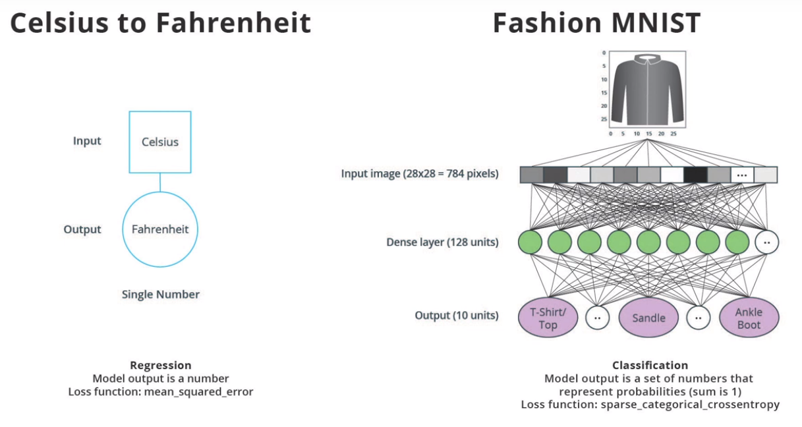

# tf-deep-learning
This repository contains my work from Udacity's Intro to Deep Learning with TensorFlow course.  

Course Link: https://classroom.udacity.com/courses/ud187  

## Contents

### 1. Celsius to Farenheit Converter 
Proof of concept project for how machine learning work using a linear regression model (predict a single value from input).

Potential expansions: 
- Ability to test multiple numbers at once, rather than one value 
- Find the relationship between other linear equations
- Find the relationship between more complex equations (add more nodes based on complexity?)

### 2. Clothing Classifier  
Classify 10 types of clothing from the Fashion MNIST dataset using a simple neural network.  

Uses with 87.84% accuracy on the test dataset.

Potential expansions:
- Work on RPi for live detection?

#### Linear Regression versus Classification Problems

| | Classification | Regression |
|-|----------------|------------|
|Output| List of numbers that represent probabilities for each class| Single Number|
|Example| Fashion MNIST | Celsisu to Fahrenheit|
|Loss | Sparse categorical crossentropy | Mean squared error|
|Last Layer Activation Function| Softmax | None |

### 3. Clothing Classifier using a Convolutional Neural Network
Classify 10 types of clothing with the Fashion MNIST dataset, except this time using a convolutional neural network.  

Uses two convolution filters and MaxPooling with 91.72% accuracy on the test dataset. This is an improvement from using a single hidden Dense layer.

### 4. Dogs and Cats Image Classifier
Classify dogs and cats with the Kaggle dataset using a neural network and image augmentation.

General machine learning workflow
1. Examine and understand data
2. Build an input pipeline
3. Build our model
4. Train our model
5. Test our model
6. Improve our model/Repeat the process

### 5. Flower Classifier
Classify images of flowers using a neural network and image augmentation.

## License

The licenses used by TensorFlow, the makers of the course, have been included in the [LICENSE](license) file in this repository. 
